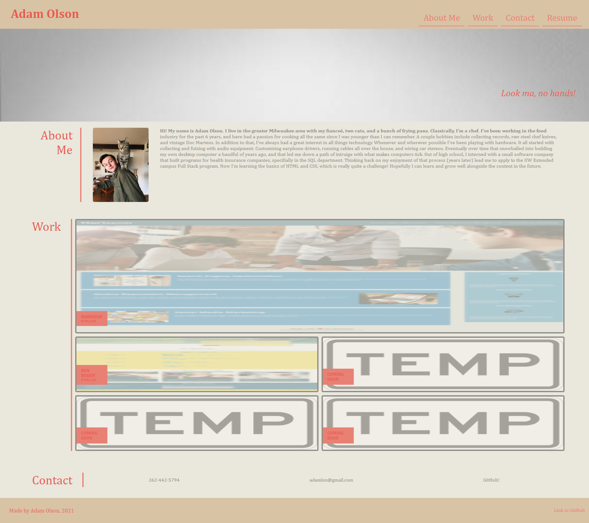
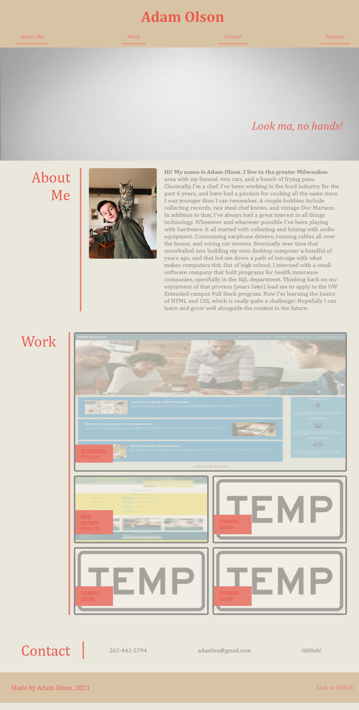
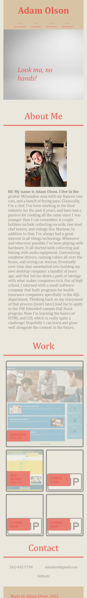

# PORTFOLIO

## GOAL
To make a functional portfolio page with advanced css styling elements. The most challenging part of this assignment was for sure making the box layout for the 'work' section. I ended up doing research into a grid layout using the 'grid-template' options, rather than fighting with flexbox for an eternity. I still struggled to algin the 'h2' headers on the left with each other vertically. Media queries and general HTML building was the easiest part for sure. Psuedo code is a really interesting concept that I hope to play more with in the future.

## LINK TO GITHUB REPO
[CLICK HERE](https://github.com/adamlsn/portfolio)

## LINK TO LIVE APPLICATION
[CLICK HERE](https://adamlsn.github.io/portfolio/)

## SOME SCREENSHOTS TO SHOW DIFFERENCE IN MEDIA QUERIES

#### FULL SIZE

#### MID SIZE

### MOBILE SIZE
